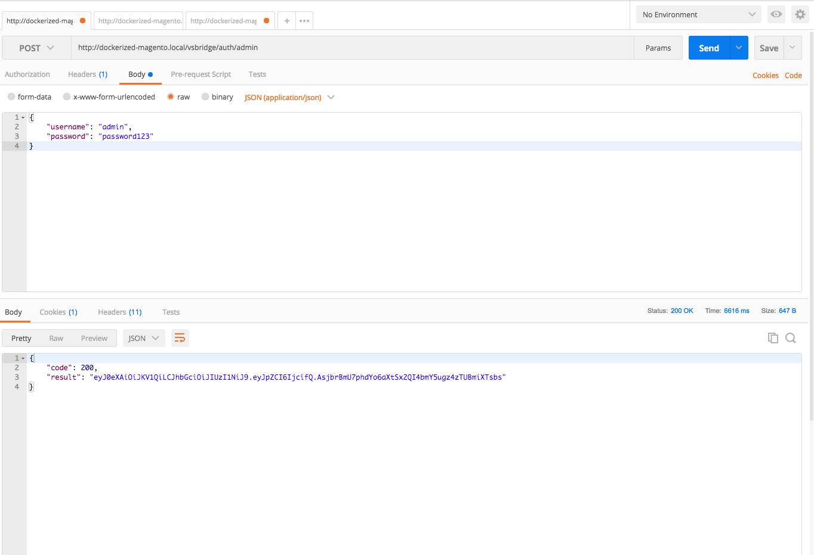
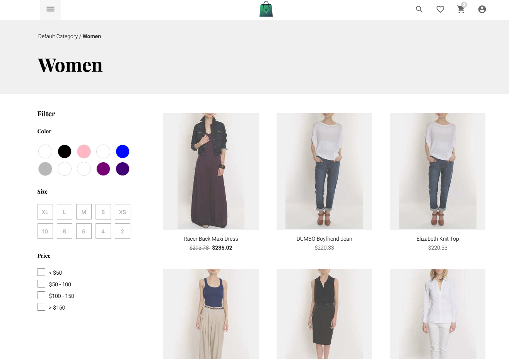
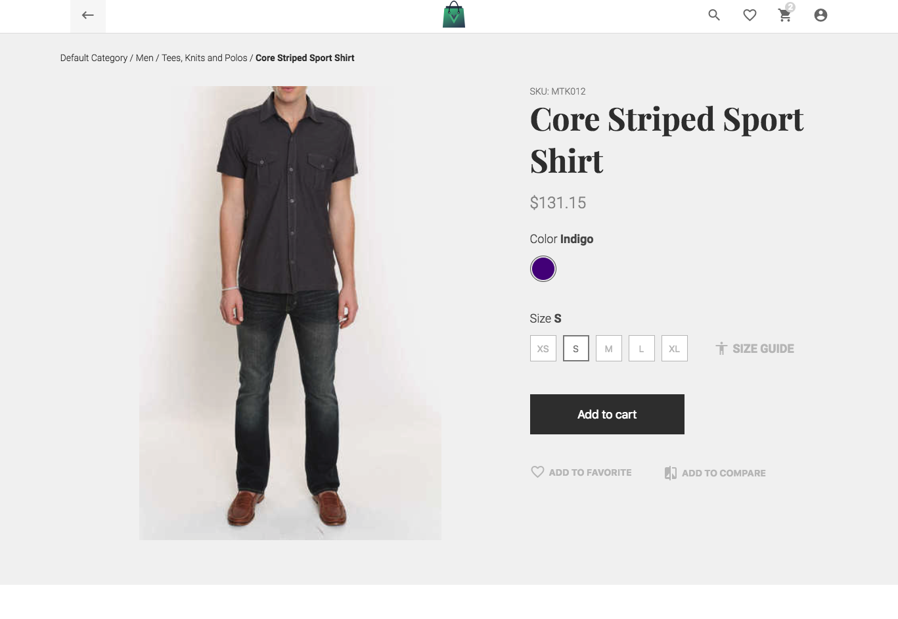

# Vue Storefront support for Magento 1.9
This projects enables You to use Magento 1.9 as a backend platform for [Vue Storefront - first Progressive Web App for e-Commerce](https://github.com/DivanteLtd/vue-storefront). 

[](https://demo-magento1.vuestorefront.io)

Vue Storefront is a standalone PWA storefront for eCommerce. It can be conencted with any eCommerce backend (eg. Magento, Pimcore, Prestashop or Shopware) through the API.

[](https://www.youtube.com/watch?v=L4K-mq9JoaQ)

Sign up for a demo at https://vuestorefront.io/ (Vue Storefront integrated with Magento2 or Magento1).

# Magento 1.9 data bridge
Vue Storefront is platform agnostic - which mean: it can be connected to virtually any eCommerce CMS. This project is a data connector for *Magento 1.9*.

**This bridge at current stage is synchronizing the catalog part: *products, categories, attributes and taxRules*  the missing part is *users, orders and cart* synchronization. If you like to have two way communication just contact us at contributors@vuestorefront.io**.

Areas for improvements:
- performance (right now it's single threaded but can be easily modified to use node-cluster),
- dynamic-requests handling (user accounts, shopping carts, orders).

# Setup and installation
Magento 1.9 bridge uses it's own Magento API which is available as [standard Magento module](https://github.com/DivanteLtd/magento1-vsbridge/tree/master/magento1-module/). The second part is a node.js app which is used to consume the API results.

Requirements: Magento 1.9x Community or Enterprise; Node.js >= 8; [vue-storefront](https://github.com/DivanteLtd/vue-storefront) and [vue-storefront-api](https://github.com/DivanteLtd/vue-storefront-api) installed.

## Magento module setup

First, please clone the whole repository locally:

```
git clone https://github.com/DivanteLtd/magento1-vsbridge.git magento1-vsbridge
cd magento1-vsbridge
cp magento1-module/app/* <MAGENTO_FOLDER>/app/
```

Magento module uses JWT tokens authorization method based on standard Magento admin users account system. **Please create a dedicated admin account** for magento1-bridge purposes only with minimal access (ACL) to the catalog part.

Then, please configure the JWT Secret in Magento configuration: System > Configuration > Services > VueStorefront Bridge.

https://github.com/DivanteLtd/magento1-vsbridge/blob/3f92a6d842e6afb4c7e34e789229848710127b8b/magento1-module/app/code/local/Divante/VueStorefrontBridge/etc/config.xml#L5

Then please clean the Magento cache.
To make sure that the module works just fine You can try to authorize the user using Postman:



## Node app setup

As You've probably noticed in the cloned directory there is a second folder called [`node-app`](https://github.com/DivanteLtd/magento1-vsbridge/tree/master/node-app). This is a consumer application that's responsible for synchronizing the Magento1 data with the ElasticSearch instance.

This tool required ElasticSearch instance up and running. The simplest way to have one is to install [vue-storefront](https://github.com/DivanteLtd/vue-storefront) and [vue-storefront-api](https://github.com/DivanteLtd/vue-storefront-api) and run `docker-compose up` inside `vue-storefront-api` installation as the project [contains Docker file](https://github.com/DivanteLtd/vue-storefront-api/blob/master/docker-compose.yml) for Vue Storefront.

Then you need to modify the configs:

```
cd node-app/src
cp config.example.json config.json
nano config.json
```

In the config file please setup the following variables:
- [`auth`](https://github.com/DivanteLtd/magento1-vsbridge/blob/5d4b9285c2dd2a20900e6075f50ebc2d7802499e/node-app/config.example.json#L9) section to setup Magento's user login and password and the previously set [JWT secret](https://github.com/DivanteLtd/magento1-vsbridge/blob/5d4b9285c2dd2a20900e6075f50ebc2d7802499e/magento1-module/app/code/local/Divante/VueStorefrontBridge/etc/config.xml#L6)
- ['endpoint'](https://github.com/DivanteLtd/magento1-vsbridge/blob/5d4b9285c2dd2a20900e6075f50ebc2d7802499e/node-app/config.example.json#L14) should match your Magento 1.9 URL,
- [`elasticsearch.indexName`](https://github.com/DivanteLtd/magento1-vsbridge/blob/5d4b9285c2dd2a20900e6075f50ebc2d7802499e/node-app/config.example.json#L4) should be set to Your ElasticSearch index which then will be connected to the Vue Storefront. It can be fresh / non-existient index as well (will be created then). For example You may have: `vue_storefront_mangento1`

## Vue Storefront setup

**Please note:** current version of magento1-vsbridge requires the latest version of VS, from ['develop' branch installed](https://github.com/DivanteLtd/vue-storefront/tree/develop). Please make sure youre using the most recent code.

By default Vue Storefront uses ES index named `vue_storefront_catalog`. Please apply the changes accordingly to:
- `vue-storefront` [config file](https://github.com/DivanteLtd/vue-storefront/tree/master/config) `local.json` to point to right index name,
- `vue-storefront-api` [config file](https://github.com/DivanteLtd/vue-storefront-api/tree/master/config) `local.json` to point to right index name.

Restart `vue-storefront` and `vue-storefront-api`.

# Available commands
The bridge works on temporary, versioned ES indexes. You decide when the index should be published (when all data objects are properly set).

Create new version of index (for example: vue_storefront_mangento1_1): 
```
node index.js new
```

Index data:
```
node index.js attributes
node index.js taxrules
node index.js categories
node index.js products
```

Publish new version of index (creates an alias with prod. name of the index: vue_storefront_magento1_1 -> vue_storefront_magento1): 
```
node index.js publish
```

Congratulations! After this step You should have got the ES index synchronized with the Magento1 instance!

# Screenshots

Please visit [Vue Storefront site](http://vuestorefront.io) to check out why it's so cool!



As you may observed, configured products do work perfectly well after imported to Vue Storefront!



# Customization & contributions
Please feel free to extend Magento module or Node app and contribute Your changes to the community!

Some ideas for contributions:
- media gallery sync,
- shopping cart / order sync (please [contact us for details](contributors@vuestorefront.io)).

# License 
`magento1-vsbridge` source code is completely free and released under the [MIT License](https://github.com/DivanteLtd/vue-storefront/blob/master/LICENSE).

